

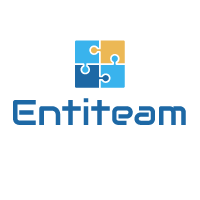

---

This is our app to manage internal recruitment processes for NTT DATA Spain and Affiliates. 

Here you can add, edit or delete candidates, interviewers, interviews, processes and view statistics on the selection processes.

---

### :link: **Links to project:** 
#### :arrow_right: FrontEnd: 
https://github.com/checkmyprojects/recruitment-process-frontend

#### :arrow_left: Backend: 
https://github.com/checkmyprojects/recruitment-process-backend

###  :space_invader: Tech Stack

Angular  Angular Material  Typescript  HTML  CSS  rxJS  redux-observable  Git  NodeJS  npm  ng2-charts   sheetJS   xngbreadcrumbs

We have used **Angular and its Material** library to make our application, since with Material, only the necessary components are loaded and this improves the loading of the application.

#### Other libraries used:
- **RxJS** to simplify the asynchronous code.
- **redux-observable** to compose and cancel asynchronous actions and create side effects.
- **ng2-charts** for the development of dynamic graphics.
- **sheetJS** for exporting a DB table to an xls document.
- **xngbreadcrumbs** to implement the "breadcrumbs" and to be able to see the path of each page.
- **PdfMake** for the creation of pdfs from the client side of Angular.
- **jspdf + html2canvas** automatically adjusts the width of the target domain to the PDF size. And if the height of the content is more than 1 pdf, it will automatically separate it into another pdf page.

**Git** as a version control system and **Github** as a repository for the project divided into branches for better organization.

We have used the **auth guard** service to protect the application's routes.

Our goal is to facilitate the hiring process of the HR department, bringing together all the roles in a single app.

---
### This is a landing page of our project:

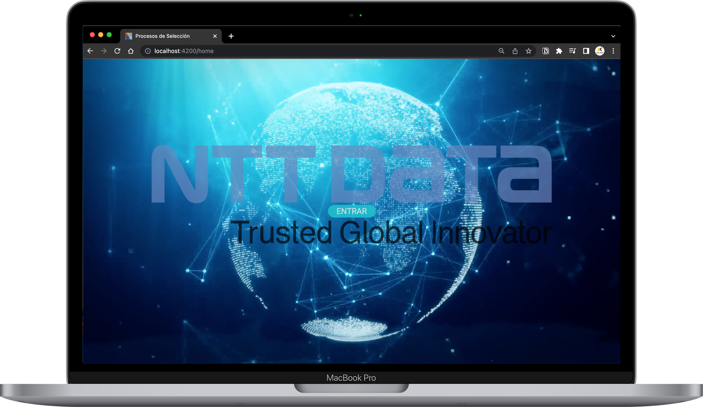

  
Others Screenshots

  #### Login
  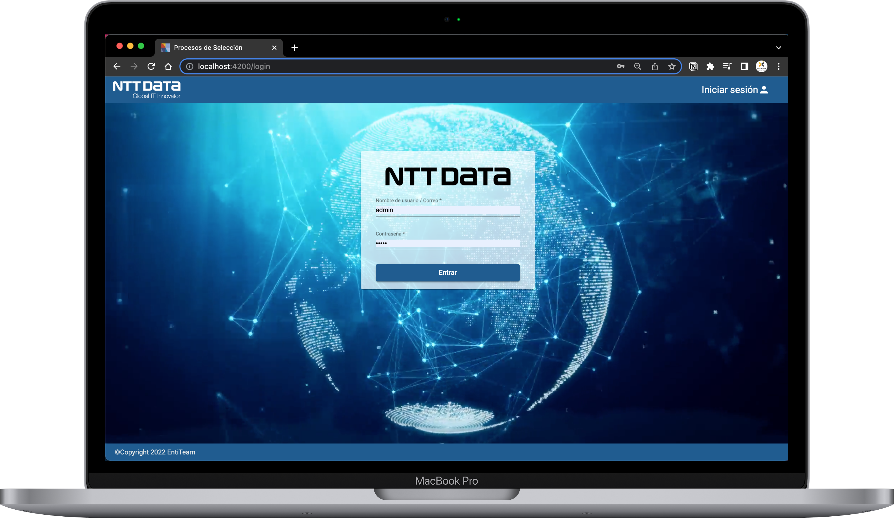

  #### Manage users as administrator role 
  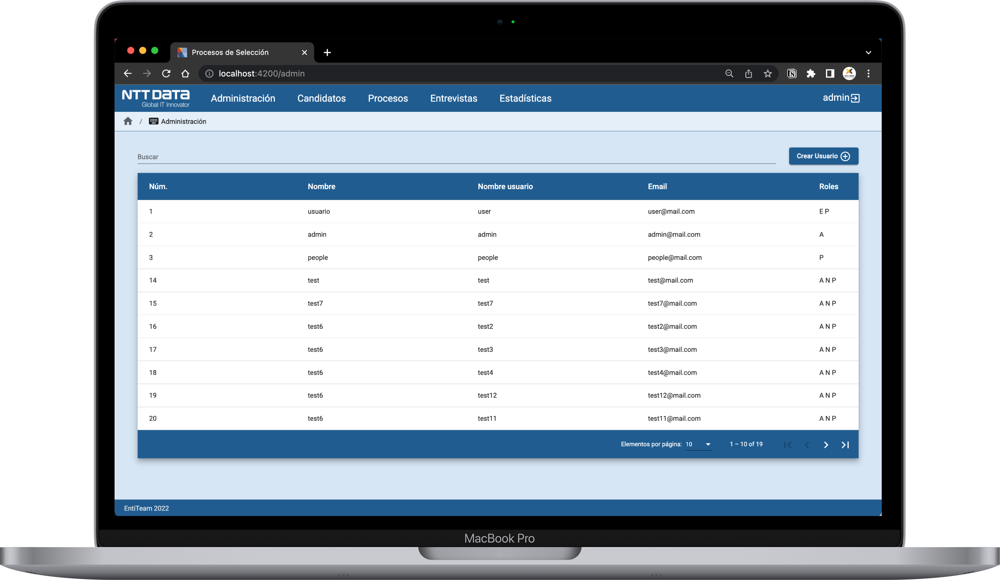

  #### New user
  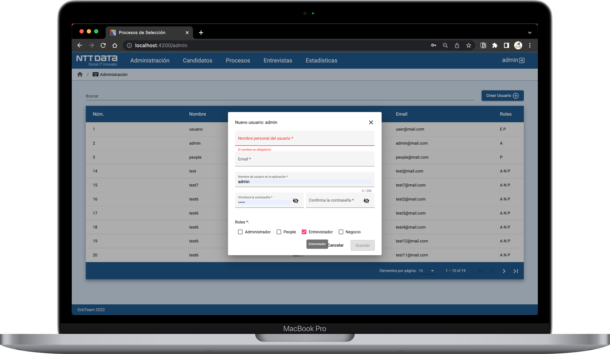

  #### New selection process
  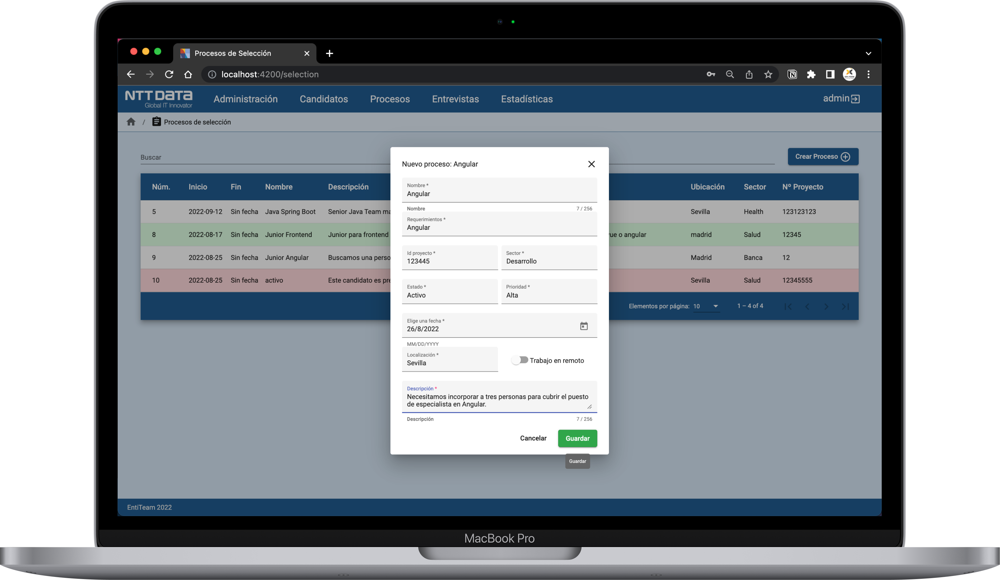

  #### New Candidate
  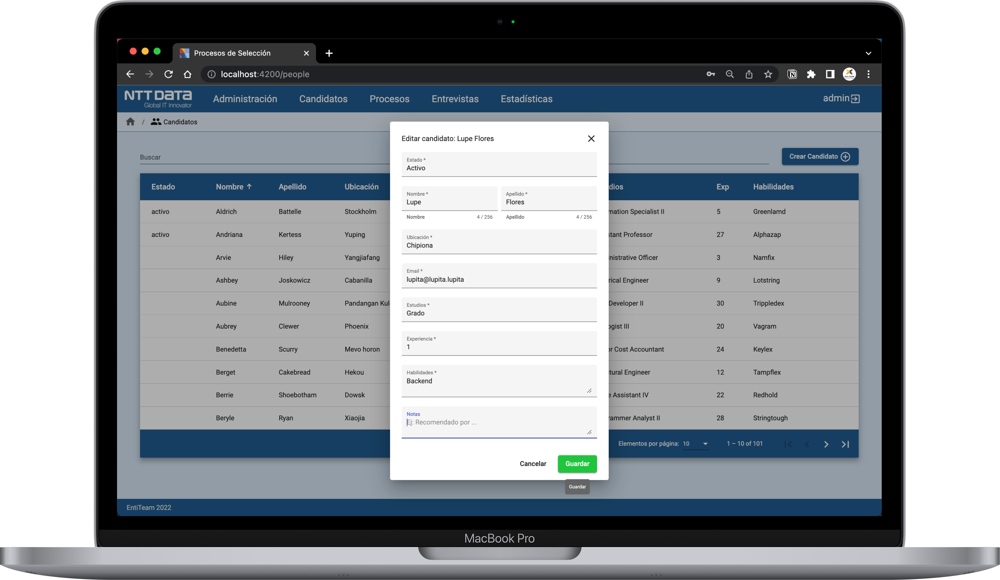

  #### New interview
  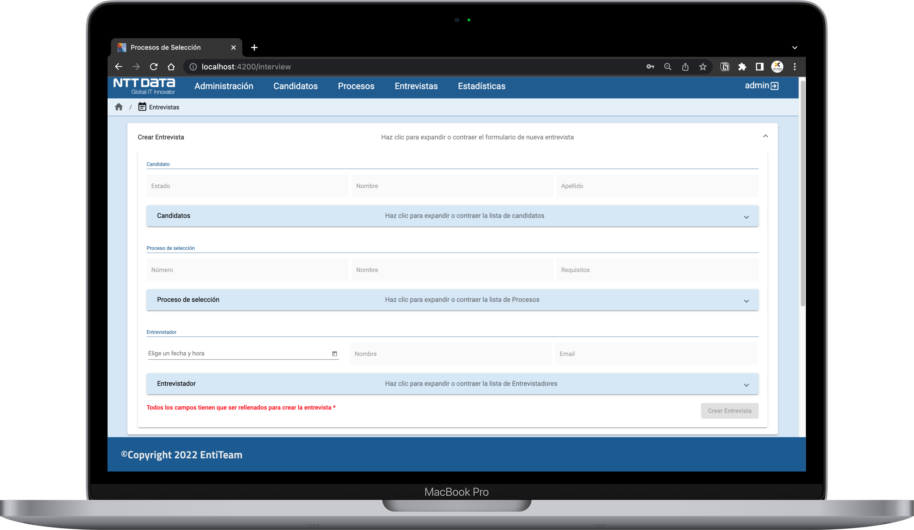

  #### Interviewers
  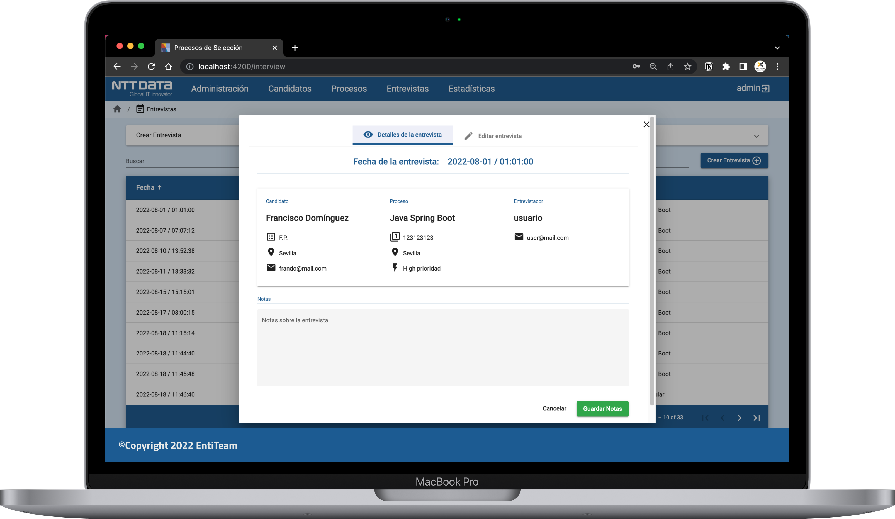

  #### Manage selection process
  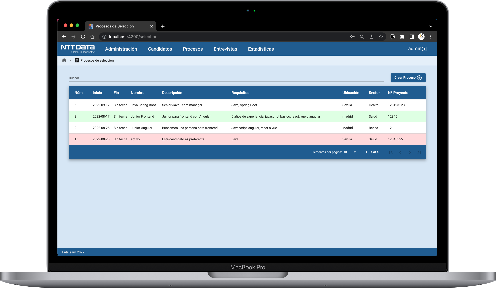

  #### Manage candidates
  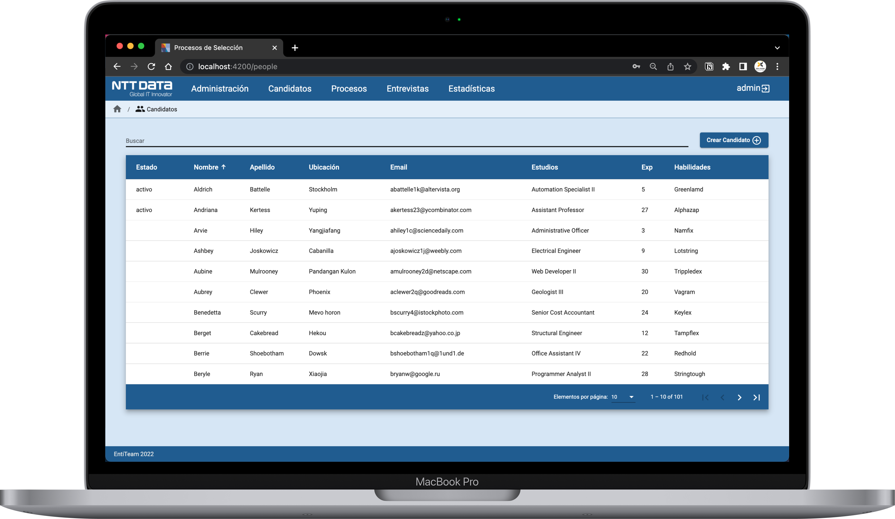

  #### Statistics
  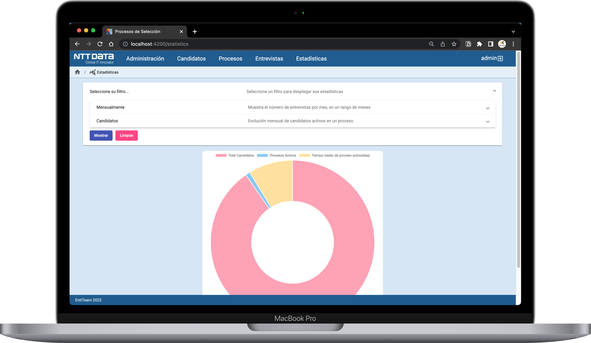

---

In this project we have worked with agile development through Scrum and Kanban, divided into six sprints and assigning our tasks in each week. Good organization is essential and we had a good time working as a team, both programming in pairs and helping our partner.

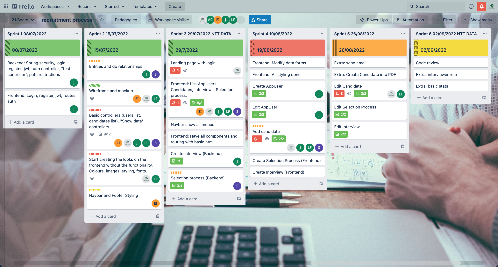

---

<!-- Color Reference -->
### :art: Paleta de colores
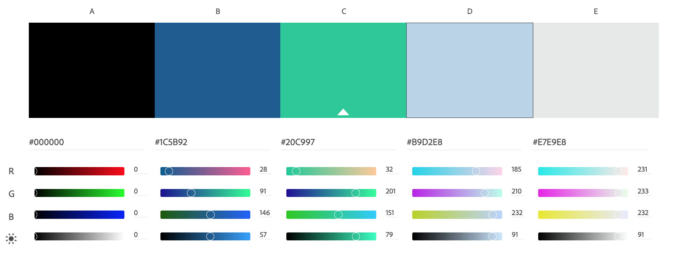

---
:checkered_flag:  Team
---

Hi there!

We are a group of enthusiastic coders excited about web developers. In our latest project we have created a web application for the HR department.

##### Scrum Master/developer
- [Jesús Vázquez](https://github.com/checkmyprojects) 

##### Product Owner/developer

- [Lupe Flores](https://github.com/Lupe13)

##### Developers

- [Fran Domínguez](https://github.com/devfdom)
- [Samuel Alonso](https://github.com/Lupe13)
- [Elisabeth Ildeeva](https://github.com/ElisabethIld)

:memo: Lessons Learned:
---

Angular helps to develop dynamic websites while working on individual components and separate features at the same time. It makes the development process easier.

Also, we have used Material library for the first time, which has made it much easier to develop features and design.

We have used JWT in Angular to work on the security feature (registration, login and authorizations).

---
 ### :spiral_notepad: License 

This project is licensed under the **Entiteam** License - see the file [LICENSE.md](LICENSE.md) for details.

### :gift: Thanks

* Tell others about this project 📢
* Invite someone from the team to a beer 🍺 or a coffee ☕.
* Give thanks publicly 🤓.
* etc.

---
